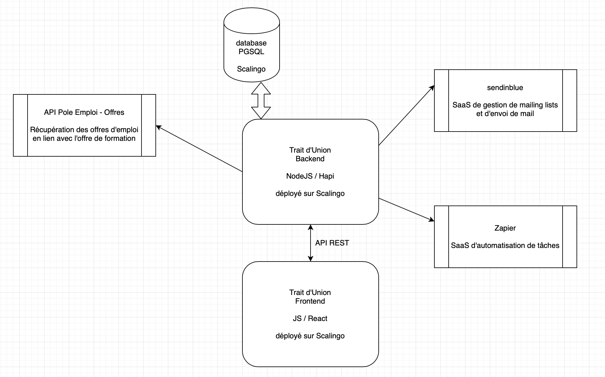

Présentation
------------

[Trait d'Union](https://traitdunion.beta.gouv.fr) s’adresse à tous les demandeurs d'emploi de la Région Grand Est.


Installation
------------

### Prérequis

Vous devez au préalable avoir correctement installé les logiciels suivants :

* [Git](http://git-scm.com/)
* [Node.js](http://nodejs.org/)
* [ReactJS](https://create-react-app.dev)

### Instructions

**1/ Récupérer le code source**

```bash
$ git clone git@github.com:betagouv/trait-d-union.git && cd trait-d-union
```

**2/ Renseigner les variables d'environnement**

Créer un fichier `.env` à la racine du projet et renseigner les variables d'environnement suivantes.

Les valeurs de production et d'intégration (staging) sont disponibles dans Scalingo.
```
  PORT (number), default: 8080
    Port on which the HTTP server will listen
    overwritten: 42

  LOG_LEVEL (string), default: info
    Level of verbosity for the logs

  HOST_NAME (string), default: localhost:8080
    Hostname used in Swagger documentation - shall contain port also

  DATABASE_URL (uri <postgres>) 
    Connection string to the main Postgres database

  AUTH0_BASE_URL (uri <https|http>)
    Auth0 base url

  OAUTH_CLIENT_ID (string)
    Client ID of Auth0 application used for swagger

  E2E_TEST (boolean), default: false
    Set to true if E2E testing is in progress

  E2E_TEST_DATABASE_URL (uri <postgres>), default: postgres://trait:dunion@db/traitdunion-e2e
    Connection string to the end-to-end tests Postgres database

  ALLOWED_ORIGIN (uri <http|https>), default: http://localhost:3000
    Front application URL allowed to call API

  TU_FF_NOTIFY_ON_SLACK (string), default: on
    Activate notification on Slack dedicated channel

  TU_FF_USE_REAL_SENDINBLUE (string), default: on
    Activate notification on Slack dedicated channel

  TU_FF_SCHEDULE_SOURCING (string), default: on
    Activate scheduling of sourcing scripts

  SLACK_NOTIFICATION_CHANNEL (string), default: #startup-tu-notif
    Slack channel on which notifications are sent to - shall start with a #

  SLACK_HOOK_URL (uri <https>)
    Slack hook url

  OFFRE_PUBLISHED_HOOK_URL (uri <https>)
    Zapier hook url called when a offre is published

  CANDIDATURE_RECEIVED_HOOK_URL (uri <https>)
    Zapier hook url called when a candidature is created

  CANDIDAT_CREATED_HOOK_URL (uri <https>)
    Zapier hook url called when a candidat is created

  COOKIE_PASSWORD (string)
    Authentication cookie password. Should be at least 32 characters long
```

**3/ Installer les dépendances**

```bash
$ yarn install
```

**4/ Lancer l'application**

Lancer la base de données locale
```bash
$ docker-compose up -d
```

Créer la base de données et charger le référentiel
```bash
$ cd api
$ yarn db:create --env local
$ yarn migrate:up --env local 
$ yarn seed:all --env local
```
Pour en savoir plus sur ces différentes commandes, se référer à [sequelize](https://sequelize.org), l'ORM utilisé par l'application.

Lancer l'API
```bash
$ cd api && yarn start
```

Lancer l'application Front
```bash
$ cd front && yarn start
```

**5/ Accéder à l'application**

[l'API](http://localhost:8080) tourne en local sur le port 8080.  
[l'application Front](http://localhost:3000) sur le port 3000.

### Stratégie de gestion de version

Tous les commits sont effectués sur la branche `staging`.  
La branche est automatiquement déployée par [Scalingo](scalingo.io) sur l'environnement `staging` [http://staging.traitdunion.beta.gouv.fr](http://staging.traitdunion.beta.gouv.fr).  

Pour déployer une nouvelle version en production.  
```bash
$ yarn release:prepare minor
```

puis

```bash
$ yarn release:publish
```

La branche `staging` est alors fusionnée dans `master` ce qui déclenche un déploiement automatique par [Scalingo](scalingo.io) sur l'environnement `production` [http://traitdunion.beta.gouv.fr](http://traitdunion.beta.gouv.fr).  


### Architecture générale

Le schéma suivant montre les dépendences externes de l'application.  


